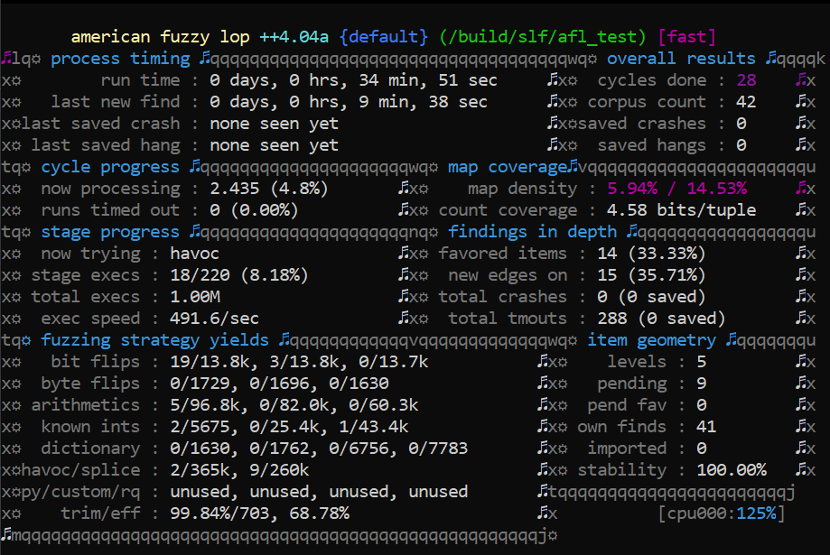

# Documentation

## Build process

If one is not familiar with cmake build process, information could be found at [Build.md](Build.md).

## Structure

Out application has 4 main component and a DLL interface.
This way it could be compiled as a shared library that has a potential to be imported.

### CAFF Processor

This class is the driving force.

It is processing a `.caff` file saved to the filesystem.

### CIFF Processor

This class processes a `CIFF` memory portion.

### CAFF validation

`CAFF_validation.h` holds all necessary logic to validate a `CAFF` file.

### CIFF validation

`CIFF_validation.h` and respectively `CIFF_validation.cc` contains logic to validate a `CIFF` file.

## Testing

We have used static analysis of sonarCloud. It was set up as a CI pipeline.

### AFL

We created a test harness `afl/TestHarness.cc` that make testing feasible.

As could be seen on the picture below, We encountered a good amount of failures.

But as we progressed through, the last (fifth) run showed us no more errors.

Error cases produced by AFL could be seen at `alf/error_cases` folder

### Unit testing

We had used Google's Gtest unit testing framework to create and define tests.

All tests could be seen in `test` folder.

These are being run during CI pipeline but could be run standalone.